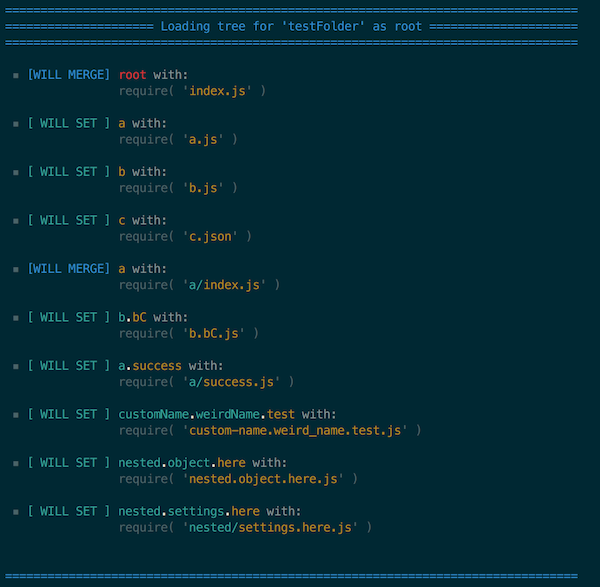

<!-- [![NPM][npm-image]][npm-url] -->

[![Build Status][build-status-image]][build-status-url] [![Dependency Status][dependencies-image]][dependencies-url]

The smart way of organizing your app's files and folders, by `requiring` recursivelly and automagicly parsing file names as their scope key.


[build-status-image]: https://img.shields.io/travis/ivanseidel/node-require-smart.svg
[build-status-url]: http://travis-ci.org/troygoode/node-require-directory
[dependencies-image]: https://gemnasium.com/badges/github.com/ivanseidel/node-require-smart.svg
[dependencies-url]: https://gemnasium.com/github.com/ivanseidel/node-require-smart
[npm-image]: https://nodei.co/npm/require-smart.png?downloads=true&stars=true
[npm-url]: https://nodei.co/npm/require-smart

## Installation

```
$ npm install require-smart
```

## Why

This library was created for three main reasons:

1. Avoid requiring an obvious object tree within each file
2. Encourage files with minimum number of business logic
3. Allow filenames to be more clear on what they do

## Usage

```javascript
const RequireSmart = require('require-smart')

const modules = RequireSmart(__dirname + '/myModulesFolder')
```

You might have this folder structure:

```
controllers
├─ users.js
├─ users.login.js
├─ users.create.js
├─ users.delete.js
├─ users.update.js
├─ queue.opts.default.js
└─ some_other.arbitrary-name.thing.js
```

Or maybe this folder structure:
```
controllers
├─┬ users/
│ ├─ index.js
│ ├─ login.js
│ ├─ create.js
│ ├─ delete.js
│ └─ update.js
├─┬ queue/
│ └─ opts.default.js
└─┬ some_other/
  └─┬ arbitrary-name/
    └─ thing.js
```

Or even an merged style:
```
controllers
├─┬ users/
│ ├─ index.js
│ ├─ login.js
│ ├─ create.js
│ ├─ delete.js
│ └─ update.js
├─ queue.opts.default.js
└─┬ some_other.arbitrary-name/
  └─ thing.js
```

You will get an object required like this:

```javascript
{
  users: {
    ... require('./users/index'), [ Gets Merged ]
    login: require('./users/login'),
    create: require('./users/create'),
    delete: require('./users/delete'),
    update: require('./users/update')
  },

  queue: {
    opts: {
      default: require('./queue.opts')
    }
  },

  someOther: {
    arbitraryName: require('./thing.js')
  }
}
```

## Options

You can customize the way `RequireSmart` loads your dependencies.

- `depth`: [Default: `true`]
  
  If set to `false`, will not load folders recursivelly. If set to a `Number`, Will load until that depth. Set to `true` for infinite recursion on require
- `canMerge`: [Default: `true`]
  
  If set to `false`, will throw exception if a object merge is needed
- `indexNames`: [Default: `['index']`]
  
  Set the array of name without extensions of 'file indexes' (usually `index` only)
- `extensions`: [Defaults: `['.js', '.json']`]
  
  Sets the valid extensions to be required
- `fileNameSeparator`: [Defaults: `.`]
  
  What token to use as separator of file names.
- `uppercaseTokens`: [Defaults: `/[_\s-]]\w/g`]
  
  A regex that maches the separation, and the first character of the next word
    
### Know what is happening

If you desire to view what are the steps to be performed during the require, you can use the method `view`:

```javascript
RequireSmart.view(__dirname + '/myModulesPath')
```

It will print out for each one of the files, the destination hash on the object, and also if it
will get `merged` or `set`. Like so:




## Discouragements

Use this library as close to the top of your application. This is something really usefull
for loading controllers, helpers, models, modules, wales and cats. However, you should use 
this with care.

If you are building a Library or maybe something that the user (and not you) might have controll,
be aware of the power you might be giving him. Think about security. Again.


### Creator
[Ivan Seidel](https://github.com/ivanseidel/node-require-smart)